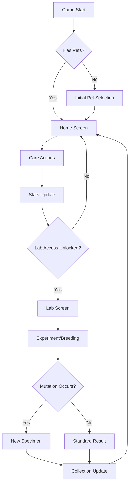

# Bio_Petz Web Game Design Document

## Overview

Bio_Petz is a virtual bio-pet simulation game integrated into the BiO-GameZ suite. Players manage virtual bio-engineered pets with mutation mechanics, daily care routines, and experimental lab procedures. The game emphasizes progression through breeding, mutations, and specimen collection, fitting the bio-hazard theme of the platform.

## Game Concept

### Core Mechanics
- **Virtual Pets**: Bio-engineered creatures with genetic traits that can mutate and evolve
- **Home Care**: Daily maintenance activities (feeding, cleaning, playing, medical care)
- **Lab Experiments**: Breeding, genetic manipulation, and experimental procedures to induce mutations
- **Mutation System**: Random trait changes through experiments, breeding, or environmental factors
- **Specimen Collection**: Unlock and collect different bio-pet species through gameplay progression

### Game Loop
1. Acquire initial pet specimen
2. Perform daily care to maintain pet health and happiness
3. Conduct lab experiments to breed or mutate pets
4. Collect new specimens and unlock advanced lab equipment
5. Compete in pet shows or battles (future expansion)

## Architecture Overview

### Integration with Existing Platform

The game follows the established pattern of standalone web games in the BiO-GameZ suite:

```
app/src/main/assets/www/
├── bio_lobby3.html (main lobby)
├── bio_slotz/
├── knxt4/
└── bio_petz/ (new game directory)
    ├── index.html
    ├── game.js
    ├── style.css
    └── assets/
```

### Game Structure

The game consists of multiple interconnected screens managed through a single-page application architecture:

```
Bio_Petz Game
├── Home Screen (Pet Management)
├── Lab Screen (Experiments & Breeding)
├── Inventory Screen (Specimens & Items)
├── Shop Screen (Purchase items/equipment)
└── Settings Screen
```

## Component Design

### 1. Pet Entity System

```javascript
class BioPet {
  constructor(specimenId, traits) {
    this.id = generateId();
    this.specimenId = specimenId; // References specimen database
    this.traits = traits; // Genetic traits object
    this.stats = {
      health: 100,
      happiness: 100,
      hunger: 0,
      cleanliness: 100
    };
    this.age = 0;
    this.level = 1;
    this.experience = 0;
  }
}
```

### 2. Specimen Database

Predefined bio-pet species with base traits:

```javascript
const SPECIMENS = {
  's01': {
    name: 'Proto-Slime',
    baseTraits: { size: 'small', toxicity: 'low', intelligence: 'basic' },
    rarity: 'common',
    unlockRequirement: 0
  },
  's02': {
    name: 'Bio-Lurker',
    baseTraits: { size: 'medium', toxicity: 'medium', intelligence: 'adaptive' },
    rarity: 'uncommon',
    unlockRequirement: 5
  }
  // ... more specimens
};
```

### 3. Mutation System

Mutations occur during breeding or experiments:

```javascript
class MutationEngine {
  static mutate(pet, experimentType) {
    const mutationChance = this.calculateMutationChance(experimentType);
    if (Math.random() < mutationChance) {
      return this.applyRandomMutation(pet);
    }
    return pet;
  }
}
```

## Screen Designs

### Home Screen
- **Pet Display Area**: 3D or animated pet visualization
- **Stats Panel**: Health, happiness, hunger, cleanliness bars
- **Care Actions**: Feed, clean, play, medicate buttons
- **Pet Status**: Age, level, experience progress
- **Environment**: Customizable habitat with interactive elements

### Lab Screen
- **Experiment Station**: Interface for genetic manipulation
- **Breeding Chamber**: Select two pets for breeding
- **Mutation Chamber**: Risk/reward experiments
- **Equipment Panel**: Unlocked lab tools and chemicals
- **Results Display**: Show experiment outcomes

### Inventory Screen
- **Pet Collection**: Grid of owned specimens
- **Item Storage**: Consumables, equipment, decorations
- **Specimen Details**: View individual pet stats and traits
- **Transfer System**: Move pets between storage and active slots

## Integration Points

### Lobby Integration

Add Bio_Petz card to the lobby's sub-grid:

```html
<div class="std-card" onclick="window.location.href='bio_petz/index.html'">
  
  <div>
    <div style="font-family:'Orbitron'; color:var(--toxic-green); font-size:1.1rem;">BiO_PETZ</div>
    <div style="font-size:0.75rem; color:#888;">Virtual Bio-Pet Simulation</div>
    <div style="font-size:0.7rem; color:var(--toxic-green); margin-top:5px;">▶ LAUNCH INCUBATOR</div>
  </div>
</div>
```

### Data Persistence

- **Local Storage**: Save pet data, inventory, progress
- **Firebase Integration**: Optional online sync (following existing multiplayer pattern)
- **Cross-Game Integration**: Potential specimen sharing with other games

### Shared Assets

Reuse existing platform elements:
- Neon color scheme and CSS variables
- Font families (Orbitron, Share Tech Mono)
- UI components (panels, buttons, progress bars)
- Sound effects and visual effects

## Technical Implementation

### Technology Stack
- **Frontend**: HTML5, CSS3, JavaScript (ES6+)
- **Graphics**: Canvas API for pet animations, CSS for UI
- **Storage**: LocalStorage for save data
- **Audio**: Web Audio API for sound effects

### File Structure
```
bio_petz/
├── index.html          # Main game page
├── game.js            # Core game logic
├── style.css          # Game-specific styles
├── assets/
│   ├── pets/          # Pet sprites/animations
│   ├── ui/            # Interface graphics
│   ├── audio/         # Sound effects
│   └── items/         # Item icons
├── screens/
│   ├── home.js        # Home screen logic
│   ├── lab.js         # Lab screen logic
│   └── inventory.js   # Inventory screen logic
└── data/
    ├── specimens.js   # Pet species data
    ├── items.js       # Item definitions
    └── mutations.js   # Mutation rules
```

## Game Flow Diagram



## Progression System

### Experience & Levels
- Pets gain XP through care activities and successful experiments
- Level up unlocks new traits and abilities
- Higher levels required for advanced lab procedures

### Unlock Requirements
- **Lab Access**: Complete initial pet care tutorial
- **Advanced Equipment**: Win pet shows or achieve breeding milestones
- **Rare Specimens**: Specific mutation combinations or purchase from shop

### Currency System
- **Credits**: Earned from daily care, experiments, and competitions
- **Toxins**: Special currency for high-risk experiments
- **Specimen Points**: Unlocked through gameplay for purchasing rare pets

## UI/UX Considerations

### Visual Design
- Consistent with bio-hazard theme: neon greens, cyans, pinks
- CRT monitor effects, scanlines, and glitch animations
- 3D pet models with smooth animations
- Interactive lab equipment with particle effects

### Accessibility
- Keyboard navigation for all interactions
- Screen reader support for status information
- High contrast mode option
- Reduced motion preferences respected

### Mobile Responsiveness
- Touch-friendly interface
- Responsive grid layouts
- Optimized for portrait orientation (following platform pattern)

## Future Expansions

### Phase 2 Features
- **Pet Battles**: Competitive arena system
- **Multiplayer Breeding**: Share specimens with other players
- **Pet Shows**: Competition events for rewards
- **Customization**: Habitat decoration and pet accessories

### Integration Opportunities
- **Cross-Game Specimens**: Use Bio_Petz pets in other games
- **Achievement System**: Platform-wide accomplishments
- **Social Features**: Pet sharing and trading

## Conclusion

Bio_Petz will provide a compelling pet simulation experience that complements the existing BiO-GameZ suite. By leveraging the established platform architecture and design patterns, the game can be efficiently developed while maintaining thematic consistency. The mutation and breeding mechanics offer deep progression potential, while daily care routines ensure ongoing player engagement.